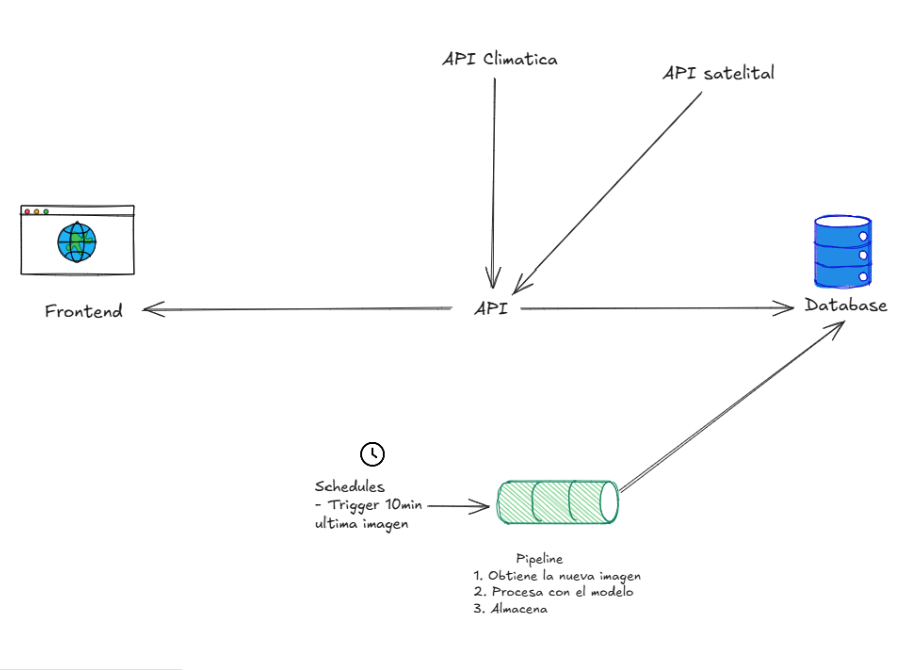

# **🌤️ APP Cielo Río Grande: API, Flujo y Backfill**

### **Flujo general**

El sistema procesa imágenes del cielo capturadas periódicamente por la cámara instalada en el observatorio.

Cada imagen pasa por un **pipeline automatizado** que se ejecuta cada 10 minutos y realiza tres tareas principales:

1. Obtiene la nueva imagen desde la fuente configurada (IMG\_URL\_BASE).

2. Procesa la imagen con el modelo de clasificación de nubes (predict\_octas).

3. Almacena el resultado en la base de datos local (registros-octas.db).

💡 *El flujo automático (trigger) se ejecuta cada 10 minutos mediante APScheduler, mientras que el backfill se utiliza de manera eventual para reconstruir períodos pasados.*

El **scheduler** (definido en `jobs/scheduler.py`) ejecuta el pipeline de forma continua, garantizando la actualización de los datos en tiempo real.

Cada ejecución genera una nueva predicción de cobertura nubosa (en octas) junto con su nivel de confianza y categoría, lo que permite alimentar el **dashboard analítico** con información actualizada y consistente.

La arquitectura se apoya en los siguientes módulos:

* **`utils.image_utils`**: construye la URL de cada imagen en base al timestamp.

* **`services.clouds_service`**: gestiona las funciones de predicciones y de obtención de ellas.

* **`data/registros-octas.db`**: almacena los registros históricos y evita duplicados mediante claves únicas.

* **`jobs/scheduler.py`**: coordina las ejecuciones periódicas del pipeline con `APScheduler`.

## **🧩 Modos de funcionamiento**

El sistema opera en **dos modos complementarios**:

| Modo | Descripción | Frecuencia |
| :---- | :---- | :---- |
| **Trigger (automático)** | Obtiene la última imagen disponible cada 10 minutos, la procesa con el modelo y guarda el resultado. | Permanente |
| **Backfill (histórico)** | Recorre un rango de fechas pasado y obtiene las imágenes correspondientes para generar el registro histórico. | Eventual / bajo demanda |

## **Backfill (`backfill.py`)**

El script `backfill.py` permite **procesar imágenes históricas** dentro de un rango de fechas específico, ejecutando el mismo flujo del pipeline principal, pero de manera **batch** (no en tiempo real).

Esto resulta útil para **reconstruir períodos pasados** o completar datos faltantes en la base que también serán utilizados por el dashboard.

### **Funcionamiento**

El backfill recorre el rango temporal definido por los argumentos `--desde` y `--hasta`, procesando imágenes en intervalos de una hora.

Dentro de cada hora se obtienen **6 imágenes fijas**, correspondientes a los minutos válidos definidos en la constante:

**MINUTOS\_VALIDOS \= \[2, 12, 22, 32, 42, 52\]**

Por cada imagen:

1. Se genera la URL mediante `image_url(IMG_URL_BASE, intento, minuto, with_year_dir=True)`.

2. Se obtiene la imagen con una sesión HTTP configurada con reintentos automáticos (`_new_session()` usa `Retry` y `HTTPAdapter`).

3. Se clasifica la imagen con `predict_octas(resp.content)`.

4. Se guarda el resultado con `save_prediction(data)`, que devuelve `True` si fue insertado o `False` si ya existía.

La ejecución contabiliza los resultados y muestra un resumen al finalizar.

### **Ejemplo de ejecución**

`python -m backfill --desde "2025-01-01T00:00" --hasta "2025-01-31T23:59"`

Durante la ejecución se mostrará el progreso y, al finalizar, un resumen con el total de imágenes procesadas:

`📊 Backfill → total=864 | nuevos=830 | duplicados=28 | fallidos=6`

### **Estructura de carpetas del proveedor**

El servidor de imágenes expone dos esquemas de ruta:

**Actual (sin subcarpeta por año)**  
 Archivos recientes disponibles en la raíz del `IMG_URL_BASE`.

 `{IMG_URL_BASE}/{YYYY}-{MM}{DD}{HH}{MM}.jpg`

1.  Ej.: `.../2025-09010002.jpg`

**Histórico (con subcarpeta por año)**  
 Años previos se sirven dentro de una carpeta por año.

 `{IMG_URL_BASE}/{YYYY}/{YYYY}-{MM}{DD}{HH}{MM}.jpg`

 Ej.: `.../2024/2024-09010002.jpg`

Por eso, cuando hacemos backfill sobre 2024 (u otros años anteriores), **hay** que incluir la carpeta del año en la URL.

### **Cómo lo maneja el código**

El helper `image_url(...)` ya admite este comportamiento mediante el parámetro  
 **`with_year_dir: bool`**:

* **Pipeline online** (`jobs/tasks.py`): `with_year_dir=False`  
   (obtiene de imágenes **recientes** en la raíz).

* **Backfill** (`backfill.py`): `with_year_dir=True`  
   (obtiene de **histórico**, incluyendo la carpeta de año).

Ejemplo en `backfill.py` :

`url_imagen = image_url(IMG_URL_BASE, intento, minuto, with_year_dir=True)`

### **Validaciones y tolerancia a fallos**

* Si `--hasta` es menor que `--desde`, el script finaliza con un mensaje de error.

* Los errores de red o imágenes no disponibles se contabilizan como **fallidos** (`miss`).

* La lógica es **idempotente**: no duplica registros ya existentes en la base.

* Cada intento tiene un tiempo de espera máximo (`timeout=10`) y dos reintentos configurados (`Retry(total=2)`).

**Variables y funciones principales**

| Variable / función | Descripción | Tipo |
| :---- | :---- | :---- |
| **MINUTOS\_VALIDOS** | Lista de minutos fijos por hora (6 imágenes). | Constante |
| **\_new\_session()** | Crea la sesión HTTP con política de reintentos. | Interna |
| **backfill(desde, hasta)** | Ejecuta el recorrido temporal y procesamiento. | Pública |
| **image\_url()** | Construye la URL de cada imagen según fecha y minuto. | Utilidad |
| **predict\_octas()** | Ejecuta el modelo de clasificación y devuelve el resultado. | Servicio |
| **save\_prediction()** | Guarda el registro en la base o lo omite si ya existe. | Servicio |

**Consideraciones Finales:** 

El sistema **Cielo Río Grande** combina un flujo continuo de actualización automática con un mecanismo histórico flexible (backfill).

Esta arquitectura permite mantener un registro completo y consistente de la nubosidad, tanto actual como pasada, garantizando datos confiables para el análisis y la visualización en el dashboard.

**🔌 Endpoints de la API**

El sistema expone una serie de endpoints implementados en **FastAPI**, que permiten consultar los resultados generados por el pipeline y complementar la información visualizada en el dashboard.

Todos los endpoints están definidos dentro de la carpeta `backend/routers/`.

### **`/octas`**

Devuelve la **última predicción registrada** en la base de datos, incluyendo la cobertura nubosa en octas, el tipo de cielo, el nivel de confianza y la URL de la imagen procesada.

Es el punto de acceso principal para el **dashboard en tiempo real**.

### **`/historial`**

Permite consultar el **registro histórico** de predicciones dentro de un rango de fechas opcional (`desde` y `hasta` en formato `YYYY-MM-DD`).  
 Si no se especifican fechas, devuelve el conjunto más reciente de registros.  
 Incluye validación interna que impide solicitar rangos en los que `hasta < desde`.

### **`/imagen`**

Redirige a la **última imagen del cielo disponible** en el servidor público.

Si la imagen correspondiente al instante actual no está disponible, retrocede automáticamente 10 minutos.

Se utiliza para **visualizar la imagen en vivo** en el dashboard.

### **`/satellite`**

Obtiene y devuelve una **imagen satelital (PNG)** con la capa de nubosidad proveniente de OpenWeatherMap.

Se emplea como **complemento visual** para contrastar la predicción local con datos satelitales externos.

### **`/clima`**

Consulta el **estado meteorológico actual** (temperatura, humedad, presión, viento, etc.) a través del servicio OpenWeatherMap.

Sirve para enriquecer el contexto de las predicciones generadas por el modelo y ofrecer una visión más completa en el dashboard.

**Conclusiones Finales:** 

Estos endpoints permiten integrar los resultados del modelo con el entorno de visualización, ofreciendo acceso tanto a la predicción más reciente como a los registros históricos y datos complementarios de clima y satélite.

Todos los servicios manejan errores de red y validaciones internas para garantizar respuestas consistentes y actualizadas.

